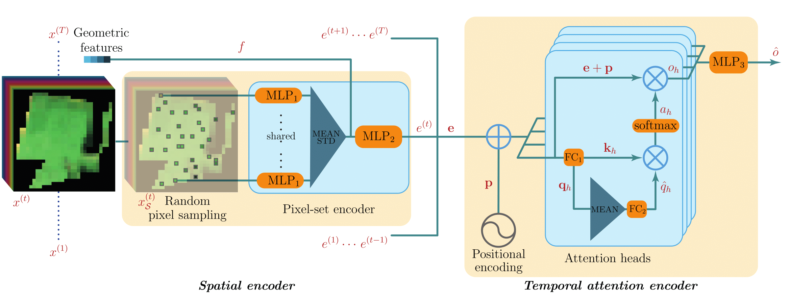

# Satellite Image Time Series Classification with Pixel-Set Encoders and Temporal Self-Attention (CVPR 2020)


PyTorch implementation of the model presented in 
["Satellite Image Time Series Classification with Pixel-Set Encoders 
and Temporal Self-Attention"](https://arxiv.org/abs/1911.07757) published ar CVPR 2020.




[Paper](https://arxiv.org/abs/1911.07757) abstract:

*Satellite image time series, bolstered by their growing availability, are at the forefront of an extensive effort towards 
automated Earth monitoring by international institutions. In particular, large-scale control of agricultural parcels is 
an issue of major political and economic importance. In this regard, hybrid convolutional-recurrent neural architectures 
have shown promising results for the automated classification of satellite image time series. We propose 
an alternative approach in which the convolutional layers are advantageously replaced with encoders operating 
on unordered sets of pixels to exploit the typically coarse resolution of publicly available satellite images. 
We also propose to extract temporal features using a bespoke neural architecture based on self-attention 
instead of recurrent networks. We demonstrate experimentally that our method not only outperforms previous 
state-of-the-art approaches in terms of precision, but also significantly decreases processing time and memory 
requirements. Lastly, we release a large open-access annotated dataset as a benchmark 
for future work on satellite image time series.*


## [UPDATES]

- **30.03.2020** Dataset preparation script available in 'preprocessing' folder + Variation of the PixeSetData class that loads all samples to RAM at init.  
- **12.03.2020** Bug fix in the TAE script (*see pull request comments*): if you were using a previous version, re-download the pre-trained weights. 

## Requirements
- Pytorch + torchnet
- numpy + pandas + sklearn

The code has been tested in the following environment:

Ubuntu 18.04.1 LTS, python 3.6.6, pytorch 1.1.0, CUDA 10.0


## Downloads

### Datasets

* A *toy version* of the Pixel-set dataset can be directly downloaded [here](http://recherche.ign.fr/llandrieu/TAE/S2-2017-T31TFM-PixelSet-TOY.zip), 
to get an idea of the dataset structure.

* The complete Pixel-set and Pixel-patch datasets are accessible upon request.

**Please send an e-mail to lastig (dot) data (at) gmail (dot) com to request access.**

### Pre-trained weights

We also provide the [pre-trained weights](http://recherche.ign.fr/llandrieu/TAE/PSETAE-PreTrainedWeights-v2.zip) for inference. 

## Code 

### Code structure
- The PyTorch implementations of the PSE, TAE and PSE+TAE architectures are located in the `models` folder. 
- The folder `learning` contains some additional utilities that are used for training. 
- The repository also contains two 
high-level scripts `train.py` and `inference.py` that should make it easier to get started. 

### Code Usage 

#### Reproduce

Run the `train.py` script to reproduce the results of the PSE+TAE architecture presented in the paper. 
You will just need to specify the path to the *Pixel-Set* dataset (link above) with the `--dataset_folder` agrument. 

#### Experiment

The default settings of the `train.py` script are those used to produce the results in the paper. 
Yet, some options are already implemented to play around with the model's hyperparameters and other training settings. 
These options are accessible through an argparse menu (see directly inside the script). 


#### Re-use

- You can use the [pre-trained weights](http://recherche.ign.fr/llandrieu/TAE/PSETAE-PreTrainedWeights-v2.zip) in the `inference.py` script to produce predictions on our dataset or your own, provided that it is formatted as per the indications below. You will need to pass the path to the unzipped folder containing the weights with the `--weight_dir` argument. (*do not* uncompress the `model.pth.tar` files as the script takes care of this.) 

- The two components of our model (the PSE and the TAE) are implemented as stand-alone 
pytorch nn.Modules (in `pse.py` and `tae.py`) and can be used for other applications.
While the PSE needs to be used in combination with the PixelSetData class, 
the TAE can be applied to any sequential data (with input tensors of shape batch_size x sequence_length x embedding_size). 

## Data format

In order to use the PixelSetData dataset classs with other data than those provided in the link above,
 the data folder should be structured in the following fashion: 
 
#### Data structure

###### Samples

Each dataset sample consits in the different observations for a single parcel. 
The observations are aggregated in a single array of shape **TxCxS** with **T** the number of temporal observations,
 **C** the number of channels, and **S** the number of pixels in the parcel (different for each data sample).
Each of these arrays should be stored separately in a *numpy* file: `unique_id_of_the_sample.npy`

All the individual `.npy` files are stored in the same sub-directory **DATA**.

###### Normalisation values
The normalisation values should be computed beforehand and stored in the form of a tuple of arrays (means, stds) 
in a pickle file in the main folder. The PixelSetData dataset class can adapt to different normalisation strategies 
depending on the shape of the arrays:
- Channel-wise normalisation for each date &rarr; the arrays have have shape (TxC)
- Channel-wise normalisation &rarr; the arrays have shape (T,)
- Global normalisation &rarr;  In that case each of the two arrays consists in a single value. 

#### Labels

The labels should be stored in the `META/labels.json` file. This file has a nested dictionary like structure and 
can contain multiple nomenclatures:


```
labels.json = {
  "Name_of_nomenclature1": {
    "unique_id_0": label_0,
    ...,
    "unique_id_N": label_N,
    }, 
  "Name_of_nomenclature2": {
    "unique_id_0": label_0,
    ...,
    "unique_id_N": label_N,
    }
}
```


#### Dates and pre-computed features 

The dates of the observations, if they are going to be used for the positional encoding,
 should be stored in **YYYYMMDD** format in the `META/dates.json` file:

```
dates.json = {
    1: date_0,
    ...,
    T: date_T,
}
```

If some pre-computed static parcel features are to be used between the two MLPs of the PSE, 
they should be stored in another json file `META/name_of_features.json`:

```
name_of_features.json = {
    "unique_id_0": features_0,
    ...,
    "unique_id_N": features_N,
}
```

#### Folder structure 
The dataset folder should thus have the follwoing structure:

Dataset_folder <br/>
│   normalisation_values.pkl     
└─DATA <br/>
│&nbsp;&nbsp;&nbsp;&nbsp;│  sample0.npy<br/>
│&nbsp;&nbsp;&nbsp;&nbsp;│  . . .<br/>
│&nbsp;&nbsp;&nbsp;&nbsp;│  sampleN.npy<br/>
└─META <br/>
 &nbsp;&nbsp;&nbsp;&nbsp; │  labels.json<br/>
 &nbsp;&nbsp;&nbsp;&nbsp; │  dates.json<br/>
 &nbsp;&nbsp;&nbsp;&nbsp; │  geomfeat.json<br/>


## Credits

- The **Temporal Attention Encoder** is heavily inspired by 
[the works of Vaswani et al.](https://papers.nips.cc/paper/7181-attention-is-all-you-need.pdf) on the Transformer, 
and [this pytorch implementation](https://github.com/jadore801120/attention-is-all-you-need-pytorch) 
served as code base for the TAE.py script. 
- Credits to  github.com/clcarwin/ for [the pytorch implementation](github.com/clcarwin/focal_loss_pytorch) 
of the focal loss

## Reference

In case you use part of the present code, please include a citation to the following paper:

```
@article{garnot2019psetae,
  title={Satellite Image Time Series Classification with Pixel-Set Encoders and Temporal Self-Attention},
  author={Sainte Fare Garnot, Vivien  and Landrieu, Loic and Giordano, Sebastien and Chehata, Nesrine},
  journal={CVPR},
  year={2020}
}

```
